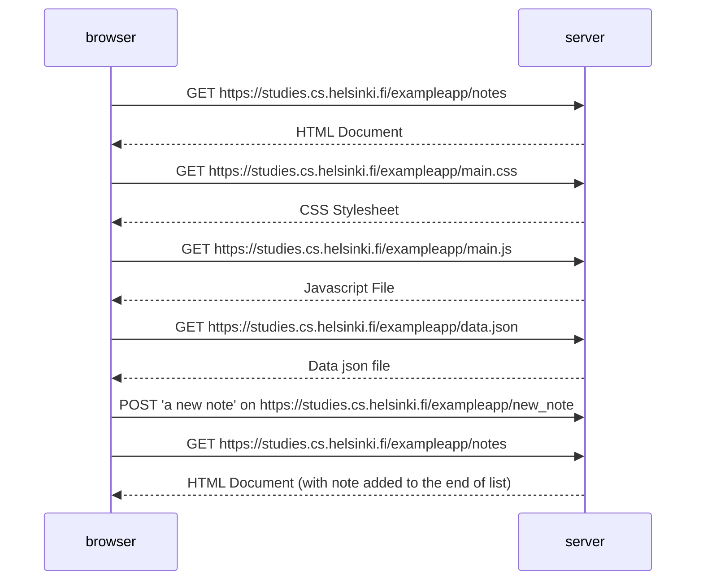

# New Note Diagram
Following diagram depicts [page](https://studies.cs.helsinki.fi/exampleapp/notes "notes") loading and then adding a new note to the server and the displayed result on the page.

```mermaid
sequenceDiagram;
  browser->>server: GET https://studies.cs.helsinki.fi/exampleapp/notes
  server-->>browser: HTML Document
  browser->>server: GET https://studies.cs.helsinki.fi/exampleapp/main.css
  server-->>browser: CSS Stylesheet
  browser->>server: GET https://studies.cs.helsinki.fi/exampleapp/main.js
  server-->>browser: Javascript File
  browser->>server: GET https://studies.cs.helsinki.fi/exampleapp/data.json
  server-->>browser: Data json file
  browser->>server: POST 'a new note' on https://studies.cs.helsinki.fi/exampleapp/new_note
  browser->>server: GET https://studies.cs.helsinki.fi/exampleapp/notes
  server-->>browser: HTML Document (with note added to the end of list)

```
