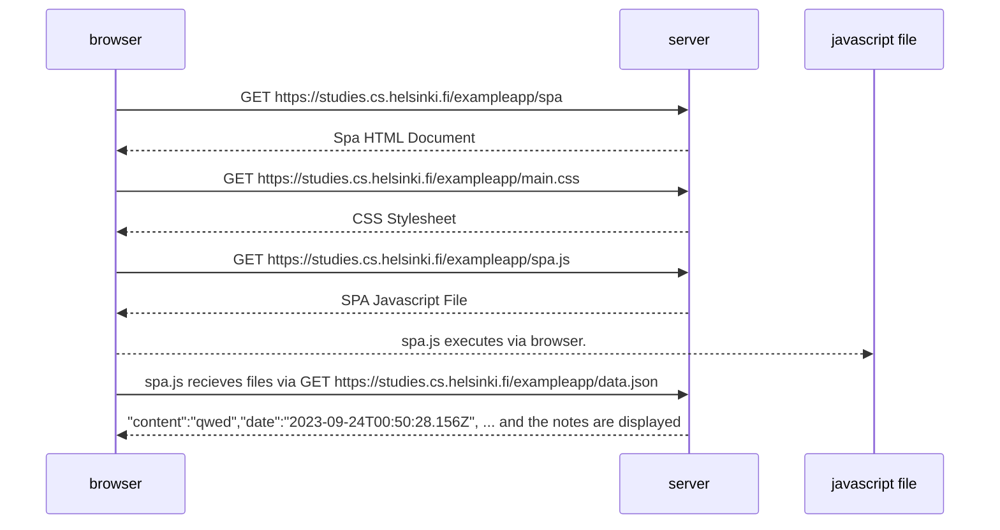

# Notes Program Diagram (SPA Version)
Following diagram depicts [single page app](https://studies.cs.helsinki.fi/exampleapp/spa "notes") loading.

```mermaid
sequenceDiagram;
  browser->>server: GET https://studies.cs.helsinki.fi/exampleapp/spa
  server-->>browser: Spa HTML Document
  browser->>server: GET https://studies.cs.helsinki.fi/exampleapp/main.css
  server-->>browser: CSS Stylesheet
  browser->>server: GET https://studies.cs.helsinki.fi/exampleapp/spa.js
  server-->>browser: SPA Javascript File
  browser-->>javascript file: spa.js executes via browser.
  browser->>server: spa.js recieves files via GET https://studies.cs.helsinki.fi/exampleapp/data.json
  server-->>browser: "content":"qwed","date":"2023-09-24T00:50:28.156Z", ... and the notes are displayed
```
