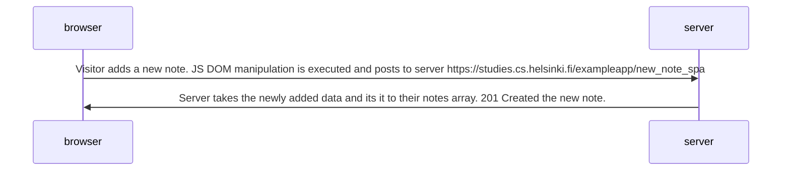

# New Note Diagram (SPA Version)
Following diagram depicts [single page app](https://studies.cs.helsinki.fi/exampleapp/spa "notes") loading and then adding a new note to the server and the displayed result on the page.

